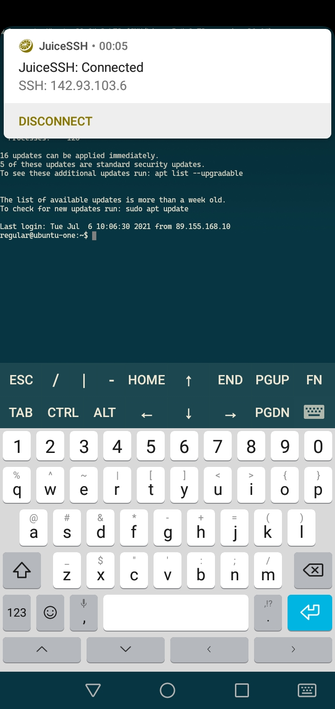
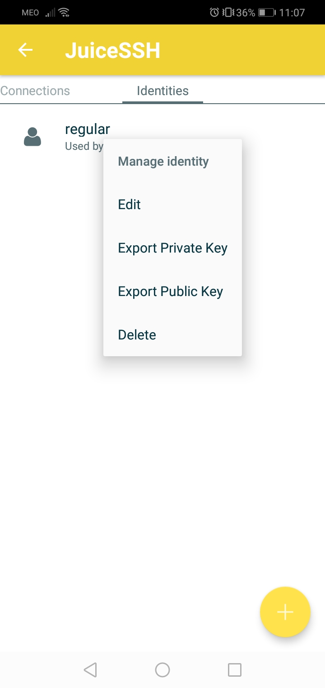
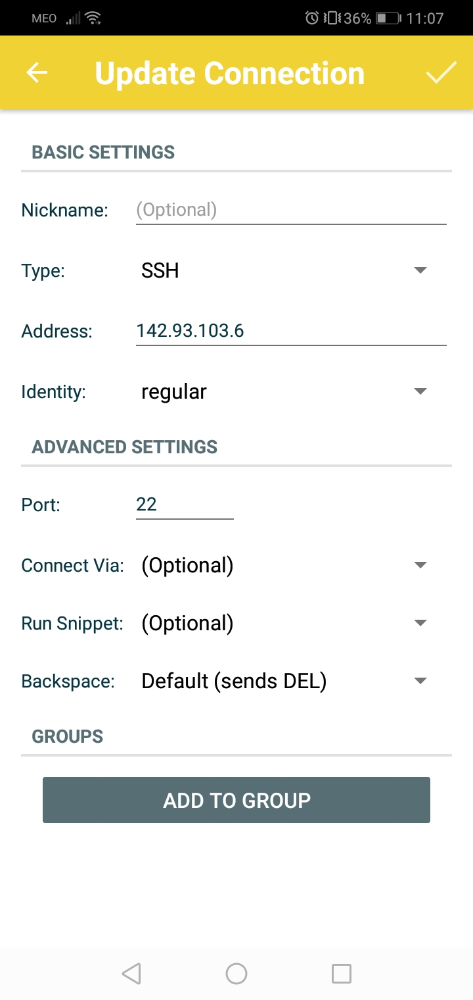
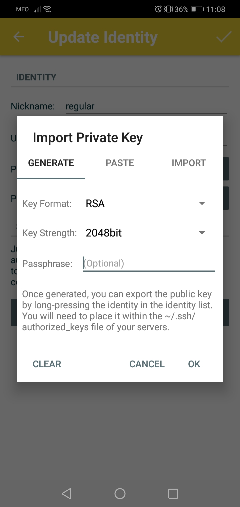

# DevOps

## Cheat cheet
### Create ssh-key

        ssh-keygen
    
### Add key

        ssh-add <private_part>

### Log into machine

        ssh <user>@<ip>
        #If you have multiple ssh keys, it's better to specify it, or else you might get an error about failed attempts:
        ssh -i <private_ssh> <user>@<ip>
        #extra:
        append "-v" at the end to see details of the connection attempt 

### Linux version

        hostnamectl

### Copy files into another machine

        scp -i <ssh_private> <src_file> <user>@<ip>:<target_dir>

### Log into machine and run script (already on the target machine)

        ssh <user>@<ip> "<script_location_on_target_machine>"

### Create user

        adduser <user>

### Give sudo permission to user

        usermod -aG sudo <user>

### See user permission

        id <user>

### Copy files & preserve permissions & change ownership

In this example, we make a copy of the current user's .ssh folder into another user

        rsync --archive --chown=<target_user>:<target_user_group> ~/.ssh /home/<target_user>

### Change user

        su <user>
        
### Delete user

        userdel -r <user>

### Get number of existing users
    
        getent passwd | wc -l

### Search for a user
    
        getent passwd | grep <user>

### Copy and paste

        apt install xclip
        alias copy="xclip -sel clip"
        alias paste="xclip -out -sel clip"

The alias "copy" is equivalent to CTRL + C, and "paste" is equivalent to CTRL + V.

        
        cat <text_file> | copy
        paste

### Update packages on new server

Recommended after creating a new server

        sudo apt update
        sudo apt upgrade

### Disable root login

Open `etc/ssh/sshd_config` and set the following:

* PermitRootLogin no

* PasswordAuthentication no

### Start `ssh-agent` 
In case you get "Could not open a connection to your authentication agent" error message

        eval `ssh-agent -s`

### Create a `config` file
It makes it easier to log into remote server machines without needing to type their IP

Use [config](./config) file as a template, and make sure it is placed in `.ssh` folder.
Usage:
                
        ssh <custom_name>

### Edit profile on server machine

`/etc/profile` is executed when the machine starts. It is a good place to set aliases and more commands.

### Log file

In `/var/log/auth.log` you can monitor accesses that have been made into the server machine (really useful stuff)!

### SSH via Android device
You can SSH into server machines using Android mobile apps

Download JuiceSSH - SSH Client: https://play.google.com/store/apps/details?id=com.sonelli.juicessh

A few shots from the app:

